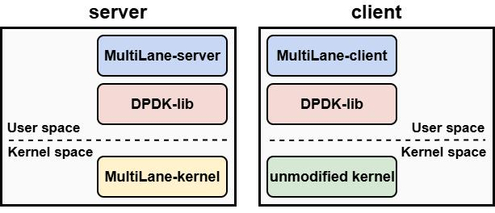

# SBB

This repository contains the artifact of the OSDI '2026 paper: **SBB: Eliminating Centralized Bottlenecks in Userspace Network Runtime**.

## Overview

<div align="left">

</div>

```text
.
├── BE-app/
├── dpdk/
├── multilane-client/
├── multilane-kernel/
├── multilane-server/
├── scripts/
└── README.md
```

It mainly contains:

- `multilane-server/`: the SBB user-space network runtime and server datapath
- `multilane-client/`: the DPDK-based client and load generator to evaluate multilane-server
- `multilane-kernel/`: a kernel tree customized for SBB, based on Linux v6.12.20
- `dpdk/`: the DPDK library, unmodified v25.07.0
- `scripts/`: helper scripts for build, NIC binding, execution, and result processing, etc.

## Environment Requirements

In order to run and evaluate SBB, the following requirements should be confirmed:

- CPU: Intel CPU with User Interrupts support (i.e. 4th Gen or later Intel Xeon Scalable processor)
- CPU cores: at least 32 cores available to the workload
- Network: two NICs that can be bound to `vfio-pci`, each at 100 Gbps link rate or higher
- Compiler: a compiler with support for `-muintr`
- BIOS: xAPIC configuration
- Software: git, Python 3, Meson, Ninja, pkg-config, etc.


For reference, we used the following setup when conducting evaluations in the paper:

Server:

- CPU: 2× Intel(R) Xeon(R) Platinum 8592+ (64 cores per socket)
- RAM: 16× 64 GB DDR5 RDIMM (~1 TB total)
- Storage: 7 TB logical volume (Broadcom MegaRAID MR9560-16i)
- NIC: Intel E810-C dual QSFP (100G-class)

Client:

- CPU: 2× AMD EPYC 9965 (192 cores per socket)
- RAM: 16× 64 GB DDR5 RDIMM (~1 TB total)
- Storage: 2× ~1.7 TB (Intel SSDSC2KB01)
- NIC: Intel E810-C dual QSFP (100G-class)

## Getting Started

### Kernel

*This step is only needed on server.*

We provide two ways to obtain the MultiLane-kernel source:

1. Use the `multilane-kernel/` directory in this repository directly.
2. Apply the `multilane-kernel/multilane-kernel.pt` patch file. Download the Linux kernel source from the official Linux repository, then run `patch -p1 < multilane-kernel.pt`. This approach is more portable, but when using other kernel versions you may need to resolve some conflicts.

Follow these steps to use the new kernel:

1. Build and Install the kernel:

```bash
cd multilane-kernel
sudo ./build_and_install_kernel.sh
```

2. Configure Kernel Commandline:

Open `/etc/default/grub`, add or modify the line:

```bash
GRUB_DEFAULT="Advanced options for Ubuntu>Ubuntu, with Linux 6.12.20-multilane"
GRUB_CMDLINE_LINUX="isolcpus=0-48 nohz_full=0-48 intel_iommu=on iommu=pt watchdog_thresh=0 lapic=notscdeadline nohz=off highres=off nohibernate nox2apic"
```
Note that core numbers for `isolcpus` and `nohz_full` should be adjusted according to the demand.

3. Update and reboot:

```bash
sudo update-grub
sudo reboot
```

### Build and Setup

*This step is needed on both server and client.*

1. Build DPDK:

```bash
sudo ./scripts/build_dpdk.sh
```

This builds DPDK into:

- `dpdk/build`
- `dpdk/build-install`

2. Build Server:

```bash
sudo ./scripts/build_multilane_server.sh
```

The server binary is generated at `multilane-server/build/multilane-server`.

3. Build Client:

```bash
sudo ./scripts/build_multilane_client.sh
```

The client binary is generated at `multilane-client/build/multilane-client`.

4. DPDK Setup:

The repository currently provides a minimal helper script:

```bash
sudo ./scripts/dpdk_config.sh
```

This script currently:

- allocates `32768` 2 MB hugepages
- loads `vfio-pci`
- binds PCI device `0000:27:00.0` to `vfio-pci`

Adjust the configurations to match your requirements and the machine environment.

### Run Experiments

1. Run the server:

```bash
./scripts/run_multilane_server.sh
```

Press Ctrl+C to stop the server.

Edit the command line in `scripts/run_multilane_server.sh` as needed for your setup. To check multilane-server options, run the binary with `-- -h`. They are also organized below:

```bash
./multilane-server/build/multilane-server [EAL options] -- -p PORTMASK [-A APP] [-L] [-T] [-C]
```

Server options:

- `-p`: port bitmask in hex (e.g. `0x1`)
- `-A <APP>`: application type: `synthetic` (default), `memcached`, or `rocksdb`
- `-L`: enable load balancing
- `-T`: enable timer interrupt
- `-C`: enable co-location
- `-h`: print usage


2. Run the client:

```bash
./scripts/run_multilane_client.sh
```

Press Ctrl+C to stop the client.

Edit the command line in `scripts/run_multilane_client.sh` as needed for your setup. To check multilane-client options, run the binary with `-- -h`. They are also organized below:

```bash
./multilane-client/build/multilane-client [EAL options] -- \
  -c COUNT -l TARGET_RPS -p PORTMASK -t TX_CORES -r RX_CORES [-A APP] [-d DIST] [-R GET_RATIO]
```

Client options:

- `-c`: number of packets to send
- `-l`: target total RPS across all TX workers
- `-p`: port bitmask in hex (e.g. `0x1`)
- `-t`: TX worker lcore range (e.g. `1-16` or comma-separated IDs)
- `-r`: RX worker lcore range (same range syntax as `-t`)
- `-A`: application type: `synthetic` (default), `memcached`, or `rocksdb`
- `-d`: synthetic load distribution; only valid with `-A synthetic`. One of: `fixed_1`, `fixed_10`, `exponential_10`, `high_bimodal`, `extreme_bimodal`, `rocksdb_ht`, `rocksdb_lt`, `tpcc` (default: `fixed_1`)
- `-R`: GET fraction in `[0,1]` for memcached/rocksdb request mixes; only valid with `-A memcached` or `-A rocksdb`
- `-h`: print usage

For application workloads and interfaces, see [multilane-server/applications/README.md](multilane-server/applications/README.md).
